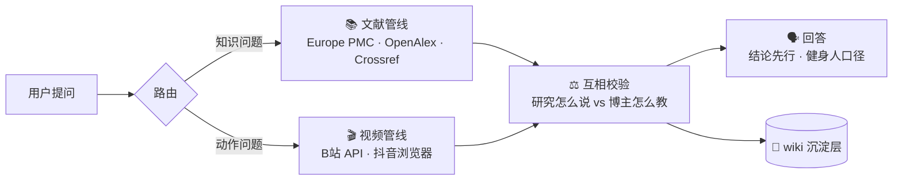

<div align="center">

# 🏋️ 肌格拉底

### 未经检索的结论不值得信

*一个会查文献、看视频、说人话的循证健身技能 —— ZCode / 通用 agent 均可安装*

[](https://www.python.org/)
[](LICENSE)
[](#-安装)
[](#-它能干什么)

名字取自苏格拉底——什么都先问一句：**研究怎么说？**

</div>

---

## ✨ 它能干什么

| | 功能 | 一句话体验 |
|---|---|---|
| 📚 | **循证知识问答** | 问"蛋白粉到底有没有用？"→ 三源实时检索真实文献、逐条验证引用、标置信度（strong / moderate / emerging） |
| 🎬 | **动作教学归纳** | 问"深蹲怎么练？凯圣王是怎么教的？"→ 抓 AI 字幕、弹幕爆点、高赞评论，归纳要点并附跳转链接 |
| 💾 | **越用越厚的 wiki** | 每次深挖沉淀成条目；下次先查条目再跑管线，越用越快越准 |
| ⭐ | **UP 主白名单** | 偏好的 UP 自动置顶标注（当前：凯圣王、谭成义）；装好后 AI 会先问你想看谁 |

## 🧭 工作原理



两条管线互相校验：文献说"研究反对"而博主坚持的做法，回答里会**明确标注冲突**。

## 🚀 安装

一行命令，自动发现技能并写入你 agent 的技能目录：

```bash
npx skills add Master-Lxz/muscle-socrates
```

<details>
<summary>没有 Node.js？直接克隆也行</summary>

```bash
git clone https://github.com/Master-Lxz/muscle-socrates.git ~/.agents/skills/muscle-socrates
# ZCode 也支持 ~/.zcode/skills/muscle-socrates
```

</details>

> 🇨🇳 国内网络访问 GitHub 需自行解决加速（FastGithub、代理等）
> 🤝 装好后**第一次使用，AI 会先问你的 UP 主白名单偏好**——默认凯圣王、谭成义，可自由增删换人，确认一次终身有效

依赖极简：Python 标准库为主（3.10+）。B站登录时自动补装纯 Python 包 `qrcode`（终端出二维码）；
弹幕解压已兼容B站当前的"裸 deflate"格式，个别节点需要可选的 `pip install brotli`（脚本会提示）。

## ⚡ 使用

**对话里直接说**（技能自动触发）：

> - "肌格拉底，蛋白粉到底有没有用？"
> - "深蹲膝盖要不要过脚尖？凯圣王是怎么教的？"
> - "把卧推写成一个词条"

**或命令行**（统一入口 `scripts/socrates.py`，`S` = 技能根目录）：

```bash
python "$S" status                              # 🩺 一键体检：登录态/依赖/wiki/文献源
python "$S" paper "protein intake hypertrophy"  # 📚 三源文献检索
python "$S" verify 10.1111/xxx 12345678         # ✅ 引用硬校验（exit 2 = 有问题必须中断）
python "$S" bili-search "深蹲 教学" --author 凯圣王
python "$S" bili-fetch BV1xxx BV2yyy            # 🎬 抓素材包（多视频；默认落盘 .cache/）
python "$S" douyin check                        # 📱 抖音登录态
python "$S" whitelist show                      # ⭐ 白名单管理：add/remove/uid/done
```

## 📋 一次性初始化

| 平台 | 动作 | 产物 |
|---|---|---|
| 🩺 体检 | `python scripts/socrates.py status` | 一眼看清缺什么 |
| 📺 B站 | `python scripts/socrates.py bili-login`，B站APP 扫码 | `credentials/bilibili.json`（解锁 AI 字幕） |
| 🎵 抖音 | 任意浏览器扫码登录，导出 cookie | `credentials/douyin_cookies.json`（跨 agent 通用格式） |

两个平台各登录一次，之后免维护；过期重跑登录即可。

## 🧠 设计铁律

| | 铁律 | 为什么 |
|---|---|---|
| 🚫 | **零记忆引用** | 每条引用来自实时检索并经 `verify` 硬校验，任何一条不过 → 中断修复。人的记忆会骗人，exit code 不会 |
| 🗣️ | **为健身人写作** | 结论先行、可执行优先（剂量/时机/性价比），文献细节一笔带过——回答 ≠ 论文综述 |
| ⚖️ | **研究 vs 博主 对质** | 冲突判定只有三种：一致 / 博主经验 / 冲突；文献明确反对的做法必须提醒 |
| 🛡️ | **安全红线** | 不构成医疗建议；红旗症状建议就医；最低热量红线（男 1500 / 女 1200 大卡）；排毒、燃脂丸、局部减脂直接拒绝 |

<details>
<summary>📂 目录结构</summary>

```text
muscle-socrates/
├── SKILL.md                 # 入口 + 触发路由 + 铁律 + 一行命令速查
├── scripts/
│   ├── socrates.py          # ★ 统一命令行入口（status/paper/verify/bili-*/douyin/whitelist）
│   ├── apilib.py            # 公共 HTTP（纯标准库）
│   ├── search_papers.py     # Europe PMC / OpenAlex / Crossref 检索 + OA 全文
│   ├── verify_citations.py  # DOI/PMID 存在性 + 撤稿校验（exit 2 = 硬中断）
│   ├── bili_lib.py          # B站 Cookie 持久化 / wbi 签名 / 弹幕解析
│   ├── bilibili_login.py    # 扫码登录 → credentials/bilibili.json
│   ├── bilibili_search.py   # wbi 签名搜索（白名单自动置顶 + 风控自动重试）
│   ├── bilibili_fetch.py    # 字幕/弹幕爆点/高赞评论素材包（支持多视频）
│   └── douyin_cookies.py    # 抖音 cookie 校验与跨格式转换
├── references/
│   ├── knowledge.md         # 文献管线规范
│   ├── movement.md          # 视频管线规范
│   └── douyin.md            # 抖音浏览器通用方案（不绑定特定浏览器工具）
├── config/creators.json     # UP主白名单（uid 首次命中回填）
└── wiki/                    # 沉淀层：_知识条目模板 / _动作条目模板 + 生成条目
```

</details>

## ⚠️ 安全与免责

- 不构成医疗建议；红旗症状（胸痛、晕厥、持续麻木、关节红肿发热）一律建议就医
- `credentials/` 存放登录凭证，已被 `.gitignore` 排除——**不要提交、不要分享、不要进网盘同步**

## 🌏 已知环境约束

- 开发环境 DNS 拦截了 PubMed E-utilities，文献源用 Europe PMC 替代（功能等价且免 key）
- B站 AI 字幕需扫码登录；抖音搜索有登录墙，浏览器路线为实测正解

---

<div align="center">

**肌格拉底** · 未经检索的结论不值得信 · MIT License

</div>
